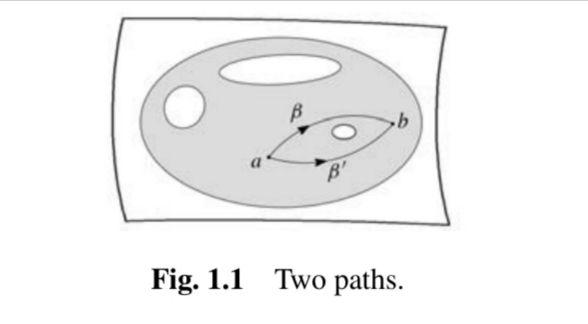

## About Philosophy
I just talk about my mathematical philosophy thinkings.

### Wittgenstein
My favourite philosopher is Wittgenstein. His book *Tractatus Logico-Philosophicus* is really worth reading! In the book, he says 
> - 1.1: The world is the totality of facts, not of things.
> - 2: What is the case -- a fact -- is the existence of states of affairs.
> - 2.01: A state of affairs (a state of things) is a combibnation of objects (things).

So what's the difference between facts and things? A fact does not only consist of many objects (things) but also their complicated relations. This philosophy is really like that of category theory where we think morphisms between objects are more important than onjects themselves. It seems the world is a very complicated category. But note that this book was completed in 1918 much earlier than the work of Eilenberg and Mac Lane.

The most famous sentence in this book is 
> 7: What we cannot speak about we must pass over in silence.

But for me the following proposition seems more important.
> 4.116: Everything that can be thought at all can be thought clearly. Everything that can be put into words can be put clearly.

As a corollary we can say **words are the boundary of thoughts**. I think the history of higher categories and higher stacks has proven this proposition true. It also motivates us to think about mathematics and put some really complicated concepts in words.

### Nietzsche
We can also consider how etymology can be applied to mathematics which I learn from Nietzsche. In his book *On the Genealogy of Morality* Nietzsche analyzes the meaning of words 'good' and 'bad', and tries to prove moral concepts are resulted from social differences. For the word 'bad' he finds how words 'common', 'plebeian' and 'low' finally change into it. 
> The best example for the latter is the German word '*schlecht*' (bad) itself: which is identical with '*schlicht*' (plain, simple) – compare '*schlechtweg*' (plainly), '*schlechterdings*' (simply) – and originally referred to the simple, the common man with no derogatory implication, but simply in contrast to the nobility. Round about the time of the Thirty Years War, late enough, then, this meaning shifted into its current usage. (*On the Genealogy of Morality*, Chapter 1 Section 4)

On the other hand in the next section, he connects the Germann word '*gut*' (good) with 'den Göttlichen' ('the godlike man') and den Mann 'göttlichen Geschlechts' (the man of 'godlike race'). 

There is another example due to Jean-Paul Sartre. In his book *L'Être et le Néant* (*Being and Nothingness*) he tells us the word 'person' originates from the Latin word 'persona' which means masks worn by actors on the stage. Therefore he thinks this can show that people are originally divorced from themselves. Your real life is the same as an actor acting in a play. The masked you is different from the real you, but you take the masked you as real because you are good at seeing yourself through the eyes of others.

Now how can we do etymological analysis in mathematics? For example here we try to understand the mathematical concept 'homomorphism'. We have 'homo → homos (Latin) → same (English)' and 'morphism → morphine (Latin) → form (English)'. Then from this point it's clear that 'homomorphism' means 'structure-preserving' which should preserve the same structures for mathematical objects. As for 'isomorphism', 'iso (Latin) = equal' and since the word 'equal' is stricter than 'same', isomorphisms should preserve structures in the stricter sense.

There is another example 'homology'. '-logy' originates from ancient Grace which just means 'class'. Hence 'homology' should mean 'similar or corresponding in some way'. In addition, this word is not unique to mathematics and it first appeared in biology in which it means similarity of the structure, physiology, or development of different species of organisms based upon their descent from a common evolutionary ancestor. A common example of homologous structures is the forelimbs of vertebrates, where the wings of bats and birds, the arms of primates, the front flippers of whales and the forelegs of four-legged vertebrates like dogs and crocodiles are all derived from the same ancestral tetrapod structure.

Now we all know in mathematics 'homology' is an abelian group but this was discovered by Noether in 1925. Before this it's used to describe some conditions in the path integeral.

For example given two points in a space, we have two paths connecting the two points. For integerable funtions P and Q, we consider the differential form Pdx+Qdy. If its integral along the two paths are equal, then they are homologous.

### Spengler
Another inspiring philosophy I think is due to Spengler in his book *Der Untergang des Abendlandes* (*The Decline of the West*) in which he talks about civilizations and thinks they are akin to biological entities, each with a limited, predictable, and deterministic lifespan but here we are interested in mathematics.
